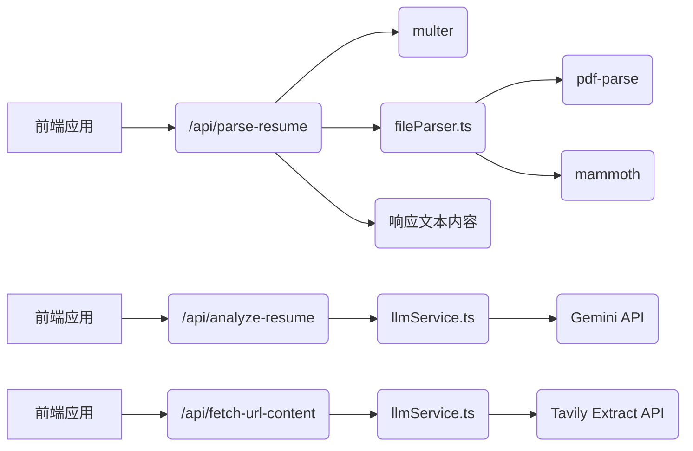

# ResumeOptimizer Backend - 需求和设计文档

## 1. 简介

ResumeOptimizer 后端服务旨在提供简历解析、分析以及 LLM 和 Tavily 相关的功能，为前端应用提供数据支持和计算能力。

## 2. 功能

### 2.1 简历解析

*   **功能描述:** 接收用户上传的简历文件（PDF、DOCX），提取文本内容。
*   **接口:** `/api/parse-resume`
*   **方法:** POST
*   **请求参数:**
    *   `resume`: 简历文件
*   **响应参数:**
    *   `text`: 提取的文本内容
*   **技术实现:**
    *   使用 `multer` 中间件处理文件上传。
    *   使用 `pdf-parse` 解析 PDF 文件。
    *   使用 `mammoth` 解析 DOCX 文件。

### 2.2 LLM 和 Tavily 相关功能

*   **功能描述:**
    *   分析简历内容，提供优化建议。
    *   根据 URL 提取网页内容。
*   **接口:**
    *   `/api/analyze-resume`
    *   `/api/fetch-url-content`
*   **方法:**
    *   POST
    *   GET
*   **技术实现:**
    *   `/api/analyze-resume`: 接收简历文本和职位描述文本，调用 Gemini API 进行分析，返回分析结果。
    *   `/api/fetch-url-content`: 接收 URL，调用 Tavily Extract API 提取网页内容，返回网页内容。
    *   从环境变量读取 API Key。
    *   设置接口请求超时时间为 10 分钟，使用 AbortController 实现。

## 3. 程序调用关系



## 4. 技术栈

*   Node.js
*   Express
*   TypeScript
*   multer
*   pdf-parse
*   mammoth
*   cors
*   body-parser
*   dotenv

## 5. 环境变量

*   `GEMINI_API_KEY`: 用于存储 Gemini 服务的 API Key。
*   `TAVILY_API_KEY`: 用于存储 Tavily 服务的 API Key。

## 6. 目录结构

```
ResumeOptimizer-backend/
├── src/
│   ├── index.ts          # 后端应用入口，Express 初始化和中间件配置
│   ├── routes/
│   │   ├── resume.ts     # 简历相关的 API 路由 (/api/parse-resume)
│   │   └── llm.ts        # LLM 和 Tavily 相关的 API 路由 (/api/analyze-resume, /api/fetch-url-content)
│   ├── services/
│   │   ├── fileParser.ts # 文件解析逻辑 (PDF, DOCX, 潜在的 DOC)
│   │   └── llmService.ts # LLM 和 Tavily 调用逻辑
│   ├── prompts/
│   │   └── gemini.prompt.ts # Gemini Prompt 文件
│   └── types/            # 后端可能需要的 TypeScript 类型定义
├── package.json          # 后端项目依赖和脚本
├── tsconfig.json         # 后端 TypeScript 配置
├── .env                  # 环境变量文件 (用于存储 API Key 等敏感信息)
└── .gitignore          # Git 忽略文件
```

## 7. 启动方式

1.  安装依赖: `npm install`
2.  编译代码: `npm run build`
3.  启动服务: `npm run start`

## 8. 代码结构说明

### 8.1 src/index.ts

*   使用 `express` 创建后端应用。
*   使用 `cors` 中间件处理跨域请求。
*   使用 `body-parser` 中间件解析 JSON 请求体。
*   配置路由，将 `/api/resume` 路由到 `resumeRoutes`，将 `/api/llm` 路由到 `llmRoutes`。
*   使用 `dotenv` 从 `.env` 文件中读取环境变量。

### 8.2 src/routes/llm.ts

*   定义 LLM 和 Tavily 相关的 API 路由。
    *   `/api/analyze-resume`: 接收简历文本、职位描述文本和 LLM 类型（默认为 'gemini'），调用 `llmService.analyzeResumeWithLLM` 函数进行分析，返回分析结果。
    *   `/api/fetch-url-content`: 接收 URL，调用 `llmService.callTavilyAPI` 函数获取网页内容，返回网页内容。
    *   `/api/analyze-resume`: 接收简历文本、职位描述文本和 LLM 类型（默认为 'gemini'），调用 `llmService.analyzeResumeWithLLM` 函数进行分析，返回分析结果。
    *   `/api/fetch-url-content`: 接收 URL，调用 `llmService.callTavilyAPI` 函数获取网页内容，返回网页内容。

### 8.3 src/services/llmService.ts

*   实现 LLM 和 Tavily 的调用逻辑。
*   `callGeminiAPI`: 调用 Gemini API，接收 API Key、简历文本和职位描述文本，返回分析结果。
*   `analyzeResumeWithGemini`: 调用 `callGeminiAPI` 函数，从环境变量中读取 API Key。
*   `analyzeResumeWithDeepSeek`: TODO: 实现调用 DeepSeek API 的逻辑。
*   `analyzeResumeWithLLM`: 根据 LLM 类型调用 `analyzeResumeWithGemini` 或 `analyzeResumeWithDeepSeek` 函数。
*   `callTavilyAPI`: 调用 Tavily Extract API，接收 URL，返回网页内容。从环境变量中读取 API Key。使用 AbortController 设置接口请求超时时间为 10 分钟。

## 9. 执行顺序

1.  前端应用发送请求到后端 API。
2.  后端 API 根据请求类型调用相应的服务函数。
3.  服务函数调用 LLM 或 Tavily Extract API。
4.  LLM 或 Tavily Extract API 返回结果。
5.  后端 API 将结果返回给前端应用。

## 10. 运行逻辑

1.  后端应用启动时，从 `.env` 文件中读取 API Key。
2.  前端应用发送简历文本和职位描述文本到 `/api/analyze-resume` 接口。
3.  后端应用调用 `llmService.analyzeResumeWithLLM` 函数，根据 LLM 类型调用 Gemini API 或 DeepSeek API，传递简历文本和职位描述文本和 llm类型。如果前端没有传递 `llmType` 参数，则默认使用 Gemini API。
4.  Gemini API 或 DeepSeek API 返回分析结果。
5.  后端应用将分析结果返回给前端应用, 传递简历文本、职位描述文本和 llm类型。
6.  前端应用发送 URL 到 `/api/fetch-url-content` 接口，传递 URL。
7.  后端应用调用 `llmService.callTavilyAPI` 函数，调用 Tavily Extract API 获取网页内容, 传递URL。
8.  Tavily Extract API 返回网页内容。
9.  后端应用将网页内容返回给前端应用，传递URL。
10. 前端应用发送 URL 到 `/api/fetch-url-content` 接口，传递 URL。
11. 后端应用调用 `llmService.callTavilyAPI` 函数，调用 Tavily Extract API 获取网页内容, 传递URL。
12. Tavily Extract API 返回网页内容。
13. 后端应用将网页内容返回给前端应用，传递URL。

## 11. 详细注释

请参考代码中的注释，特别是关于使用 AbortController 设置接口请求超时时间的部分。

## 12. API 说明书

请参考 [API 说明书](API_SPEC.md)。
