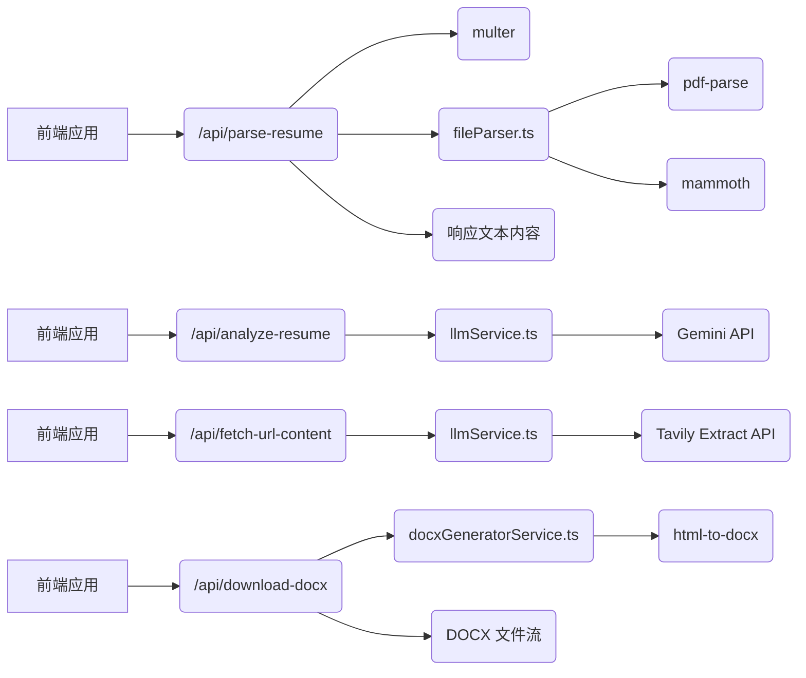

# ResumeOptimizer Backend - 需求和设计文档

## 1. 简介

ResumeOptimizer 后端服务旨在提供简历解析、分析以及 LLM 和 Tavily 相关的功能，为前端应用提供数据支持和计算能力。

## 2. 功能

### 2.1 简历解析

*   **功能描述:** 接收用户上传的简历文件（PDF、DOCX），提取文本内容。
*   **接口:** `/api/parse-resume`
*   **方法:** POST
*   **请求参数:**
    *   `resume`: 简历文件
*   **响应参数:**
    *   `text`: 提取的文本内容
*   **技术实现:**
    *   使用 `multer` 中间件处理文件上传。
    *   使用 `pdf-parse` 解析 PDF 文件。
    *   使用 `mammoth` 解析 DOCX 文件。

### 2.2 LLM 和 Tavily 相关功能

*   **功能描述:**
    *   分析简历内容，提供优化建议。
    *   根据 URL 提取网页内容。
*   **接口:**
    *   `/api/analyze-resume`
    *   `/api/fetch-url-content`
*   **方法:**
    *   POST
    *   GET
*   **技术实现:**
    *   `/api/analyze-resume`: 接收简历文本和职位描述文本，调用 Gemini API 进行分析，返回分析结果。
    *   `/api/fetch-url-content`: 接收 URL，调用 Tavily Extract API 提取网页内容，返回网页内容。
    *   从环境变量读取 API Key。
    *   设置接口请求超时时间为 10 分钟，使用 AbortController 实现。

### 2.3 DOCX 文件生成

*   **功能描述:** 根据 HTML 内容生成 DOCX 文件，支持样式、分割线和边框的转换。
*   **接口:** `/api/download-docx` (假设)
*   **方法:** POST (假设)
*   **请求参数:**
    *   `htmlContent`: HTML 字符串
*   **响应参数:**
    *   DOCX 文件流
*   **技术实现:**
    *   使用 `html-to-docx` 库进行 HTML 到 DOCX 的转换。
    *   对 HTML 内容进行预处理，将 `div` 标签实现的水平分割线转换为 `<hr>` 标签，以提高 DOCX 转换的兼容性。
    *   设置 DOCX 文件的默认字体为 'Calibri'。

## 3. 程序调用关系



## 4. 技术栈

*   Node.js
*   Express
*   TypeScript
*   multer
*   pdf-parse
*   mammoth
*   cors
*   body-parser
*   dotenv

## 5. 环境变量

*   `GEMINI_API_KEY`: 用于存储 Gemini 服务的 API Key。
*   `TAVILY_API_KEY`: 用于存储 Tavily 服务的 API Key。

## 6. 目录结构

```
ResumeOptimizer-backend/
├── src/
│   ├── index.ts          # Express 服务启动文件
│   ├── app.ts            # Express 应用配置，中间件和路由
│   ├── api/
│   │   └── index.ts      # Vercel Serverless Function 入口 (导入 src/app.ts)
│   ├── routes/
│   │   ├── resume.ts     # 简历相关的 API 路由 (/api/parse-resume)
│   │   └── llm.ts        # LLM 和 Tavily 相关的 API 路由 (/api/analyze-resume, /api/fetch-url-content)
│   ├── services/
│   │   ├── fileParser.ts # 文件解析逻辑 (PDF, DOCX, 潜在的 DOC)
│   │   └── llmService.ts # LLM 和 Tavily 调用逻辑
│   ├── prompts/
│   │   └── gemini.prompt.ts # Gemini Prompt 文件
│   └── types/            # 后端可能需要的 TypeScript 类型定义
├── package.json          # 后端项目依赖和脚本
├── tsconfig.json         # 后端 TypeScript 配置
├── .env                  # 环境变量文件 (用于存储 API Key 等敏感信息)
└── .gitignore          # Git 忽略文件
```

## 7. 启动方式

### 本地开发

1.  安装依赖: `npm install`
2.  启动服务: ``npm run start` (或者 `npm run dev` 如果 `package.json` 中 `dev` 脚本指向 `ts-node src/index.ts`)

### Vercel 部署

1.  确保项目根目录存在 `vercel.json` 文件，并配置正确。
2.  在 Vercel 平台导入 Git 仓库，Vercel 将自动检测 `vercel.json` 并进行部署。
3.  环境变量 (如 `GEMINI_API_KEY`, `TAVILY_API_KEY`) 需要在 Vercel 项目设置中配置。

## 8. 代码结构说明

### 8.1 src/index.ts

*   导入 `src/app.ts` 中配置的 Express 应用实例。
*   监听配置的端口（默认为 3000），启动 Express 服务器。
*   输出服务器启动信息到控制台。

### 8.2 src/app.ts

*   使用 `express` 创建后端应用实例。
*   配置 `cors` 中间件处理跨域请求。
*   配置 `body-parser` 中间件解析 JSON 请求体。
*   加载环境变量 (`dotenv`)。
*   应用所有 API 路由 (`resumeRoutes`, `llmRoutes`)。
*   定义根路径 (`/`) 的响应。
*   导出 Express 应用实例，供 `src/index.ts` (本地启动) 和 `api/index.ts` (Vercel Serverless Function) 使用。

### 8.3 api/index.ts

*   Vercel Serverless Function 的入口文件。
*   导入 `src/app.ts` 中导出的 Express 应用实例，并将其作为默认导出。

### 8.2 src/routes/llm.ts

*   定义 LLM 和 Tavily 相关的 API 路由。
    *   `/api/analyze-resume`: 接收简历文本、职位描述文本和 LLM 类型（默认为 'gemini'），调用 `llmService.analyzeResumeWithLLM` 函数进行分析，返回分析结果。
    *   `/api/fetch-url-content`: 接收 URL，调用 `llmService.callTavilyAPI` 函数获取网页内容，返回网页内容。
    *   `/api/analyze-resume`: 接收简历文本、职位描述文本和 LLM 类型（默认为 'gemini'），调用 `llmService.analyzeResumeWithLLM` 函数进行分析，返回分析结果。
    *   `/api/fetch-url-content`: 接收 URL，调用 `llmService.callTavilyAPI` 函数获取网页内容，返回网页内容。

### 8.3 src/services/llmService.ts

*   实现 LLM 和 Tavily 的调用逻辑。
*   `callGeminiAPI`: 调用 Gemini API，接收 API Key、简历文本和职位描述文本，返回分析结果。
*   `analyzeResumeWithGemini`: 调用 `callGeminiAPI` 函数，从环境变量中读取 API Key。
*   `analyzeResumeWithDeepSeek`: TODO: 实现调用 DeepSeek API 的逻辑。
*   `analyzeResumeWithLLM`: 根据 LLM 类型调用 `analyzeResumeWithGemini` 或 `analyzeResumeWithDeepSeek` 函数。
*   `callTavilyAPI`: 调用 Tavily Extract API，接收 URL，返回网页内容。从环境变量中读取 API Key。使用 AbortController 设置接口请求超时时间为 10 分钟。

### 8.4 src/services/docxGeneratorService.ts

*   实现 HTML 到 DOCX 的转换逻辑。
*   `generateDocxFromHtml`: 接收 HTML 字符串，对其进行预处理（将特定的 `div` 水平分割线转换为 `<hr>` 标签），然后使用 `html-to-docx` 库生成 DOCX 文件的 Buffer。设置 DOCX 文件的默认字体为 'Calibri'。

## 9. 执行顺序

1.  **本地开发:** `src/index.ts` 启动 Express 服务器，并导入 `src/app.ts` 进行应用配置和路由加载。
2.  **Vercel 部署:** Vercel Serverless Function 入口 `api/index.ts` 导入并导出 `src/app.ts` 中的 Express 应用实例。
3.  前端应用发送请求到后端 API。
4.  Express 应用根据请求类型调用相应的路由处理函数。
5.  路由处理函数调用相应的服务函数。
6.  服务函数调用 LLM 或 Tavily Extract API。
7.  LLM 或 Tavily Extract API 返回结果。
8.  后端 API 将结果返回给前端应用。

## 10. 运行逻辑

1.  **服务器启动:**
    *   **本地开发:** 运行 `src/index.ts`，它会导入 `src/app.ts` 并启动 Express 服务器，监听指定端口。
    *   **Vercel 部署:** Vercel 平台通过 `api/index.ts` 启动 `src/app.ts` 作为 Serverless Function。
2.  后端应用启动时，从 `.env` 文件中读取 API Key。
3.  前端应用发送简历文本和职位描述文本到 `/api/analyze-resume` 接口。
4.  后端应用调用 `llmService.analyzeResumeWithLLM` 函数，根据 LLM 类型调用 Gemini API 或 DeepSeek API，传递简历文本和职位描述文本和 llm类型。如果前端没有传递 `llmType` 参数，则默认使用 Gemini API。
5.  Gemini API 或 DeepSeek API 返回分析结果。
6.  后端应用将分析结果返回给前端应用, 传递简历文本、职位描述文本和 llm类型。
7.  前端应用发送 URL 到 `/api/fetch-url-content` 接口，传递 URL。
8.  后端应用调用 `llmService.callTavilyAPI` 函数，调用 Tavily Extract API 获取网页内容, 传递URL。
9.  Tavily Extract API 返回网页内容。
10. 后端应用将网页内容返回给前端应用，传递URL。

## 11. 详细注释

请参考代码中的注释，特别是关于使用 AbortController 设置接口请求超时时间的部分。

## 12. API 说明书

请参考 [API 说明书](API_SPEC.md)。
